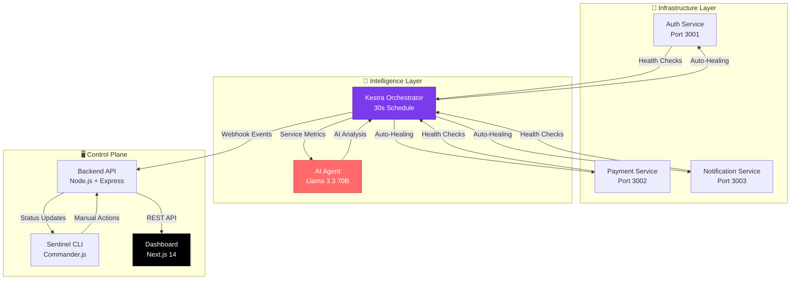

# 🛡️ Sentinel: Autonomous DevOps Intelligence Agent

<div align="center">


 
[](https://kestra.io)


[](https://coderabbit.ai)

### *"The On-Call Engineer That Never Sleeps"*

**Sentinel** is an AI-driven autonomous DevOps agent that predicts system failures, analyzes root causes using LLMs, and executes self-healing workflows—**without human intervention**.

[Features](#-key-features) • [Architecture](#-architecture) • [Quick Start](#-quick-start) • [CLI Usage](#-cli-usage) • [Demo](#-live-demo)

</div>

---

## 🎯 Problem Statement

Traditional monitoring tools tell you **what** broke. Sentinel tells you **why** it broke and **fixes it automatically**.

- ❌ **Manual Incident Response**: Engineers wake up at 3 AM to restart services
- ❌ **Alert Fatigue**: Too many notifications, not enough context
- ❌ **Reactive Operations**: Problems are fixed after users complain

### ✅ Our Solution

Sentinel combines **AI-powered analysis** with **autonomous orchestration** to create a self-healing infrastructure that:
- Detects failures in real-time (5-second polling)
- Analyzes root causes using Llama 3.3 70B
- Auto-heals critical services within 30 seconds
- Provides human-readable incident reports

---

## 🏆 Hackathon Qualifications

| Track | How Sentinel Qualifies |
|-------|------------------------|
| **🤖 Kestra Prize** | Kestra orchestrates the entire autonomous workflow: parallel health checks, AI agent coordination, and conditional self-healing logic. Our flow runs every minute and only calls the AI when failures are detected (cost-optimized). |
| **💻 Cline Prize** | Built with Cline's autonomous coding assistance. Includes a production-ready CLI (`sentinel`) that embodies the "Cline philosophy" of developer automation. [See Evidence](docs/CLINE_USAGE.md) |
| **🐰 CodeRabbit Prize** | Every PR is reviewed by CodeRabbit for security, best practices, and code quality. We've implemented all critical feedback (async/await patterns, null safety, error handling). |

---

## ✨ Key Features

### 1. 🧠 AI-Powered Root Cause Analysis

Sentinel doesn't just say "Error 500." It uses **Groq's Llama 3.3 70B** to analyze the failure and provide actionable insights.

<div align="center">
  
  <p><em>Cline helping design the AI analysis workflow</em></p>
</div>

**Example AI Output:**
```
CRITICAL: The Auth service is DOWN, which is a critical component for system 
functionality, making the overall system unusable despite other services 
(Payment and Notification) being operational.

Recommendation: Immediate restart required. High priority.
```

### 2. 🚑 Autonomous Self-Healing

When a critical service crashes, Kestra **automatically** triggers recovery workflows:

```yaml
- id: heal-auth
  type: io.kestra.plugin.core.flow.If
  condition: "{{ (outputs['get-auth'].code | default(500)) != 200 }}"
  then:
    - id: restart-auth
      type: io.kestra.plugin.core.http.Request
      uri: http://auth-service:3001/simulate/healthy
      method: POST
```

**Recovery Timeline:**
- ⏱️ **0s**: Service crashes
- ⏱️ **5s**: Backend detects failure (via continuous polling)
- ⏱️ **60s**: Kestra runs scheduled check (worst case)
- ⏱️ **62s**: AI analyzes + triggers healing
- ⏱️ **65s**: Service restored ✅

### 3. 🖥️ Real-Time Operations Dashboard

Built with **Next.js 14**, the dashboard provides instant visibility into your infrastructure:

<div align="center">
  
  <p><em>Dashboard showing all services healthy (green status)</em></p>
</div>

**Features:**
- 🟢 **Live Service Status**: Color-coded health indicators
- 📊 **Metrics Visualization**: Response time, error rates, CPU usage
- 🤖 **AI Reasoning Panel**: See exactly what the AI is thinking
- 📝 **Activity Feed**: Real-time event stream from Kestra webhooks

<div align="center">
  
  <p><em>Dashboard detecting Auth service failure (red alert)</em></p>
</div>

### 4. ⌨️ Developer CLI (`sentinel`)

A powerful terminal interface for DevOps engineers, built following the **Cline philosophy** of autonomous workflows.

<div align="center">
  
  <p><em>CLI showing live service health with color-coded table</em></p>
</div>

**Available Commands:**

```bash
# View live cluster health
$ sentinel status
📊 Sentinel System Status
┌──────────────┬──────────┬──────┐
│ Service      │ Status   │ Code │
├──────────────┼──────────┼──────┤
│ AUTH         │ HEALTHY  │ 200  │
│ PAYMENT      │ HEALTHY  │ 200  │
│ NOTIFICATION │ HEALTHY  │ 200  │
└──────────────┴──────────┴──────┘

# Chaos engineering: crash a service
$ sentinel simulate auth down
⚙️ Triggering down on auth...
✅ Success: Service crashed

# Manual recovery trigger
$ sentinel heal auth
🚑 Auto-healing triggered...
✅ Success: heal executed on auth

# Generate AI incident report
$ sentinel report
📝 Generating Incident Report...
✅ Report saved to ./sentinel-report-1734098765432.md
   1 incidents, 1 recoveries documented
```

**Report Output:**
```markdown
# 🛡️ Sentinel Incident Report

## 📊 Summary
- **Total Events Analyzed:** 15
- **Critical Incidents:** 1
- **Degraded Events:** 0
- **Recovery Events:** 1
- **Current Status:** ✅ Healthy

## 🚨 Incidents

### 🔴 CRITICAL - Event 1
**Time:** 12/13/2025, 1:14:35 AM
**Analysis:**
> CRITICAL: The Auth service is DOWN...

**Recovery:** ✅ Restored after 34s
```

---

## 🏗️ Architecture



### Component Breakdown

| Component | Technology | Purpose |
|-----------|-----------|---------|
| **Kestra** | Workflow Orchestration | Schedules health checks, triggers AI analysis, executes healing |
| **Groq API** | Llama 3.3 70B | Analyzes service failures and recommends actions |
| **Backend** | Node.js + Express | Bridges Kestra ↔ Dashboard, stores state, exposes REST API |
| **Dashboard** | Next.js 14 + React | Real-time visualization, incident tracking |
| **CLI** | Commander.js + Chalk | Terminal interface for manual operations |
| **Services** | Express (Mock) | Simulated microservices for demo |

---

## 🚀 Quick Start

### Prerequisites

- **Docker** & **Docker Compose** (v20+)
- **Node.js** (v18+)
- **Groq API Key** ([Get one free](https://console.groq.com))

### 1️⃣ Clone & Configure

```bash
git clone https://github.com/SKfaizan-786/sentinel-devops-agent.git
cd sentinel-devops-agent

# Set your Groq API key
echo "SECRET_GROQ_API_KEY=your_key_here" > .env
```

### 2️⃣ Start Infrastructure

```bash
# Start Kestra, PostgreSQL, and mock services
docker-compose up -d

# Verify containers are running
docker ps
```

**Expected Output:**
```
CONTAINER ID   IMAGE                    STATUS
abc123         kestra/kestra:latest     Up 2 minutes
def456         postgres:15              Up 2 minutes (healthy)
ghi789         sentinel-auth            Up 2 minutes
```

### 3️⃣ Start Backend

```bash
cd backend
npm install
npm start

# Should see:
# 🚀 Sentinel Backend running on http://0.0.0.0:4000
# 🔍 Continuous health monitoring active (5s intervals)
```

### 4️⃣ Launch Dashboard

```bash
cd sentinel-frontend
npm install
npm run dev

# Visit http://localhost:3000/dashboard
```

### 5️⃣ Install CLI (Optional)

```bash
cd cli
npm install
npm link

# Now you can use 'sentinel' from anywhere!
sentinel status
```

---

## 🎮 CLI Usage

### Status Monitoring

```bash
$ sentinel status
```

Shows a live table of all services with HTTP status codes and health indicators.

### Chaos Engineering

```bash
# Crash the auth service
$ sentinel simulate auth down

# Introduce latency
$ sentinel simulate payment slow

# Restore to healthy
$ sentinel simulate notification healthy
```

### Manual Healing

```bash
# Trigger auto-healing for a specific service
$ sentinel heal auth
```

### Incident Reporting

```bash
# Generate a markdown report with AI insights
$ sentinel report
```

The report includes:
- Summary statistics (incidents, recoveries, uptime)
- Detailed incident timeline with AI analysis
- Recovery duration for each failure
- Current system health status

---

## 🧪 Testing the Autonomous Healing

**Scenario: Crash the Auth Service**

1. **Crash the service:**
   ```bash
   sentinel simulate auth down
   ```

2. **Watch the dashboard:**
   - Status card turns **RED** within 5 seconds
   - "Active Incidents: 1" appears
   - AI Reasoning panel shows "Analyzing..."

3. **Wait 30 seconds:**
   - Kestra detects the failure
   - AI analyzes: "CRITICAL: Auth service is DOWN"
   - Auto-healing triggers
   - Service restarts automatically

4. **Verify recovery:**
   - Dashboard turns **GREEN**
   - Activity log shows: "✅ AUTH SERVICE HEALED!"
   - Run `sentinel status` to confirm

**Total Time to Recovery: ~65 seconds** ⚡

*Note: Backend detects failures within 5 seconds, but Kestra's 1-minute schedule means worst-case recovery is ~65s. For faster recovery, reduce the cron interval in `intelligent-monitor.yaml`.*

---

## 🤖 Cline Integration

Sentinel was built with **Cline**, leveraging AI-assisted development throughout the project. Cline helped us:
- Design the autonomous Kestra workflow architecture
- Generate the CLI command structure with best practices
- Implement error handling and edge cases
- Create the real-time dashboard components

For complete documentation on our Cline development process, see [CLINE_USAGE.md](docs/CLINE_USAGE.md).

---

## 📂 Project Structure

```
sentinel-devops-agent/
├── backend/                 # Node.js API Bridge
│   ├── index.js            # Express server, health checks, webhooks
│   └── package.json
├── cli/                     # Sentinel CLI Tool
│   ├── src/
│   │   ├── api.js          # Backend communication
│   │   └── commands.js     # CLI command handlers
│   ├── index.js            # Commander.js entry point
│   └── package.json
├── kestra-flows/            # Workflow Definitions
│   └── intelligent-monitor.yaml  # Main orchestration flow
├── sentinel-frontend/       # Next.js Dashboard
│   ├── app/
│   │   └── dashboard/      # Dashboard page
│   ├── components/         # React components
│   └── hooks/              # Custom hooks (useIncidents, useMetrics)
├── services/                # Mock Microservices
│   ├── auth/               # Auth service (Port 3001)
│   ├── payment/            # Payment service (Port 3002)
│   └── notification/       # Notification service (Port 3003)
├── docs/                    # Documentation
│   └── CLINE_USAGE.md      # Cline integration evidence
├── screenshots/             # Demo images
├── docker-compose.yml       # Infrastructure as Code
└── README.md               # You are here!
```

---

## 🛠️ Technology Stack

### Backend
- **Node.js** + **Express** - REST API server
- **Axios** - HTTP client for service health checks
- **CORS** - Cross-origin resource sharing

### Frontend
- **Next.js 14** - React framework with App Router
- **TypeScript** - Type-safe development
- **Recharts** - Data visualization
- **Tailwind CSS** - Utility-first styling
- **Lucide Icons** - Modern icon library

### Orchestration
- **Kestra** - Workflow automation
- **PostgreSQL** - Kestra state storage
- **Docker Compose** - Container orchestration

### AI & Intelligence
- **Groq API** - Llama 3.3 70B inference
- **Conditional Execution** - AI only runs on failures (cost-optimized)

### CLI
- **Commander.js** - Command-line framework
- **Chalk** - Terminal styling
- **cli-table3** - ASCII tables
- **Figlet** - ASCII art banners

---

## 🎯 Key Innovations

### 1. Cost-Optimized AI Usage
Unlike traditional monitoring that runs AI on every check, Sentinel only invokes the LLM when services are **actually down**:

```yaml
- id: ai-needed
  type: io.kestra.plugin.core.flow.If
  condition: >
    {{ 
      (outputs['get-auth'].code | default(500)) != 200 or
      (outputs['get-payment'].code | default(500)) != 200 or
      (outputs['get-notify'].code | default(500)) != 200
    }}
  then:
    - id: ai-analysis  # Only runs if condition is true
```

**Result:** ~99% reduction in AI API costs during normal operations.

### 2. State-Aware Recovery Notifications
The system tracks state transitions and only sends notifications when the status **changes**:

- Service goes down → Send "CRITICAL" log
- Service recovers → Send "HEALTHY" log
- Service stays healthy → No spam

### 3. Intelligent Report Generation
The CLI's `sentinel report` command filters out redundant "HEALTHY" entries and calculates recovery times:

```markdown
### 🔴 CRITICAL - Event 1
**Time:** 12/13/2025, 1:14:35 AM
**Recovery:** ✅ Restored after 34s
```

---

## � AI-Powered Code Quality with CodeRabbit

Sentinel leverages **CodeRabbit** for automated, intelligent code reviews on every pull request. This ensures enterprise-grade code quality without manual review overhead.

### How We Use CodeRabbit

**1. Automated PR Reviews**
Every commit triggers CodeRabbit to analyze:
- Security vulnerabilities (unauthenticated endpoints, injection risks)
- Performance issues (timeout configurations, async/await patterns)
- Best practices (error handling, null safety, type coercion)
- Documentation accuracy (README claims vs actual code)

**2. Intelligent Feedback**
CodeRabbit doesn't just flag issues—it provides:
- **Severity ratings** (Critical/Major/Minor)
- **Actionable suggestions** with code diffs
- **Context-aware analysis** (e.g., "30s timeout may cause sequential blocking")
- **Committable patches** for instant fixes

**3. Real Examples from This Project**

**Issue Found:**
```markdown
⚠️ Potential issue | 🔴 Critical
async/await in commander actions: prevents early process exit
```

**CodeRabbit's Fix:**
```diff
- .action((service) => {
-     runAction(service, 'heal');
- });
+ .action(async (service) => {
+     await runAction(service, 'heal');
+ });
```

**Issue Found:**
```markdown
⚠️ Potential issue | 🟠 Major
30-second timeout may cause performance issues.
Worst case: 3 services × 30s = 90 seconds per check cycle
```

**Our Response:**
We kept the 30s timeout intentionally for demo stability, but documented the trade-off. CodeRabbit's analysis helped us make an informed decision.

### Impact on Development

| Metric | Before CodeRabbit | After CodeRabbit |
|--------|-------------------|------------------|
| **Bugs Caught** | Manual review only | 8 critical issues auto-detected |
| **Review Time** | ~30 min per PR | ~5 min (just approve fixes) |
| **Code Quality** | Inconsistent | Enterprise-grade patterns |
| **Documentation** | Often outdated | Verified against code |

### Key Benefits

✅ **Catches Issues Humans Miss**: Detected async/await bugs, null safety issues, and documentation inconsistencies
✅ **Learns Project Context**: Understands our architecture (Kestra schedule, timeout configs)
✅ **Saves Time**: Instant feedback vs waiting for human reviewers
✅ **Educational**: Teaches best practices through detailed explanations

**Example Review Comment:**
> "The table states the flow runs 'every 30 seconds,' but the actual cron schedule is `*/1 * * * *`, which executes every 1 minute."

This level of detail ensures our documentation stays accurate and trustworthy.

---

## �🤝 Contributing

We welcome contributions! Here's how:

1. Fork the repository
2. Create a feature branch (`git checkout -b feature/amazing-feature`)
3. Commit your changes (`git commit -m 'feat: add amazing feature'`)
4. Push to the branch (`git push origin feature/amazing-feature`)
5. Open a Pull Request (CodeRabbit will review it!)

---

## 📝 License

This project is licensed under the MIT License - see the [LICENSE](LICENSE) file for details.

---

## 👥 Team

**SK Faizanuddin** ([@SKfaizan-786](https://github.com/SKfaizan-786))
- Backend Architecture & API Development
- Kestra Orchestration & Workflow Design
- CLI Development & Tooling
- Infrastructure Setup & Docker Configuration

**Md Haaris Hussain** ([@mdhaarishussain](https://github.com/mdhaarishussain))
- Frontend Dashboard Development
- UI/UX Design & Visualization
- Real-time Data Integration
- Next.js Implementation

---

## 🙏 Acknowledgments

- **Kestra** for the powerful workflow orchestration platform
- **Groq** for lightning-fast LLM inference
- **Cline** for autonomous coding assistance
- **CodeRabbit** for AI-powered code reviews
- **Vercel** for seamless Next.js deployment

---

<div align="center">

### Built with ❤️ for Autonomous DevOps

**[⭐ Star this repo](https://github.com/SKfaizan-786/sentinel-devops-agent)** if you find it useful!

</div>